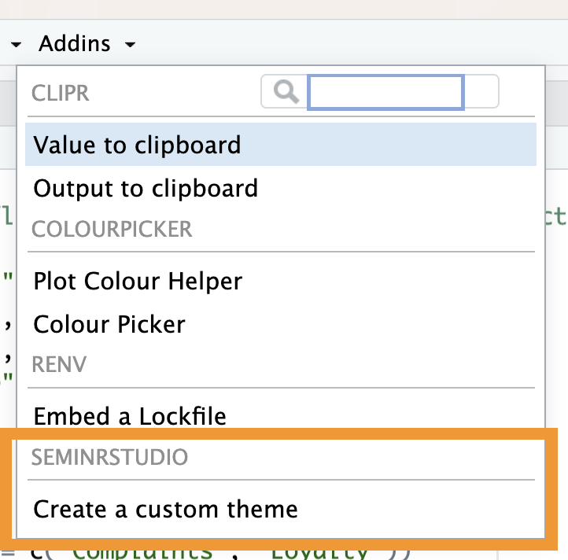

<!-- README.md is generated from README.Rmd. Please edit that file -->

# seminrstudio

<!-- badges: start -->

[](https://CRAN.R-project.org/package=seminrstudio)
[](https://codecov.io/gh/sem-in-r/seminrstudio?branch=master)
[](https://github.com/sem-in-r/seminrstudio/actions/workflows/R-CMD-check.yaml)
<!-- badges: end -->

The goal of seminrstudio is to to provide a UI based interface to the
`seminr` package. Features are made available as RStudio Addins.

## Installation

You can install seminrstudio directly from Github.

``` r
if(!require(remotes)) {
  install.packages("remotes")
}
remotes::install_github("sem-in-r/seminrstudio")
```

Someday, you will be able to install the released version of
seminrstudio from [CRAN](https://CRAN.R-project.org) with:

``` r
install.packages("seminrstudio")
```

But not yet. :-(

## Usage

The following tools are implemented at the moment:

- Theme Editor: A tool to design a seminr_theme. Install the package.
  Load it once and you should have a new RStudio “Addin”.
  
